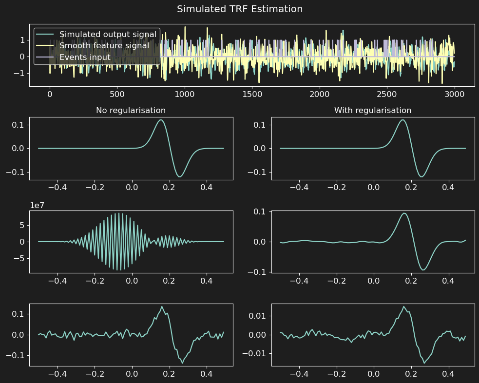

Usage
=====

First of all, the top-level namespace for the package is currently
``pyeeg``. This may change in the future to ``natmeeg`` to match the project name.
So to import the package, you can do:

.. code-block:: python

    import pyeeg
    # or
    from pyeeg import io, models
    # etc

A quick TRF example
-------------------

For a complete, runnable introduction—with simulated envelope and word-level
features, figures, cross-validation, banded ridge, smoothness regularisation,
and solver timings—see :doc:`tutorials` and the
:doc:`examples/TRF_simulation_tutorial` notebook.

The compact example below shows the essential API. A feature matrix has one
row per sample and one column per stimulus feature; the EEG response has one
row per sample and one column per channel.

.. code-block:: python

    from pyeeg import TRFEstimator
    import numpy as np
    import matplotlib.pyplot as plt

    from scipy.signal import convolve, filtfilt, butter

    # Parameters
    fs = 100  # Sampling frequency
    duration = 30  # Duration in seconds
    n_samples = int(fs * duration)  # Number of samples
    tmin = -0.5
    tmax = 0.5
    t_kernel = np.arange(tmin, tmax, 1/fs)  # Time vector for kernel
    n_events = 100  # Number of events

    # Simulated data
    # TRF kernel
    peak_time = 0.2  # Time of the peak in seconds (seconds)
    width = 0.05  # Width of the Gaussian kernel (seconds)
    kernel = np.diff(np.r_[0.0, np.exp(-(t_kernel - peak_time)**2 / (2 * width**2))])  # Gaussian kernel derivative
    # Stimuli (smooth continuous one + event based one)
    smooth_stimulus = np.random.randn(n_samples,)  # Random stimulus
    b, a = butter(4, 15, 'low', fs=fs)  # Low-pass filter (15 Hz)
    smooth_stimulus = filtfilt(b, a, smooth_stimulus)  # Filtered stimulus
    event_stimulus = np.zeros((n_samples,))  # Event-based stimulus
    onsets = np.random.randint(0, n_samples - 1, size=n_events)  # Random event onsets
    event_stimulus[onsets] = 1  # Set event onsets to 1
    # Convolve stimuli with kernel
    y_smooth = convolve(smooth_stimulus, kernel, mode='same')  # Convolve with smooth stimulus
    y_event = convolve(event_stimulus, kernel, mode='same')  # Convolve with event stimulus
    # Add noise
    y = y_smooth + y_event + np.random.randn(n_samples) * 0.1  # Add noise to the signal

    # Create TRF estimator
    trf = TRFEstimator(tmin=tmin, tmax=tmax, srate=fs, alpha=1.0)
    print(np.c_[smooth_stimulus, event_stimulus].shape, y.shape) # 2 features, 1 channel
    trf.fit(np.c_[smooth_stimulus, event_stimulus], y[:, None])
    print(trf)

    # Plot results
    f, ax = plt.subplots(4, 2, figsize=(12, 8), sharey='row')
    gs = ax[0, 0].get_gridspec()
    for a in ax[0, :]: a.remove()
    ax_wide = f.add_subplot(gs[0, :])
    ax_wide.plot(y, label='Simulated output signal')
    ax_wide.plot(smooth_stimulus, label='Smooth feature signal')
    ax_wide.plot(event_stimulus, label='Events input')
    ax_wide.legend()
    # Plot estimated kernels and result
    alphas = [0., 1e3]  # Regularisation parameters
    for k, aax in enumerate(ax[1:, :].T):
        trf.alpha = alphas[k]  # Set regularisation parameter
        trf.fit(np.c_[smooth_stimulus, event_stimulus], y[:, None]) 
        aax[0].plot(t_kernel, kernel, label='Kernel')
        trf.plot(ax=aax[1:], show=False)
        if k==0:
            aax[0].set_title('No regularisation')
        else:
            aax[0].set_title('With regularisation')
    f.suptitle('Simulated TRF Estimation')
    f.tight_layout()
    plt.show()

CCA
---

:class:`~pyeeg.CCA_Estimator` performs canonical correlation analysis between
a (possibly time-lagged) feature matrix ``X`` and a response matrix ``y``,
such as EEG channels. The minimal fit API mirrors the TRF estimator.

.. code-block:: python

    from pyeeg import CCA_Estimator
    import numpy as np

    rng = np.random.default_rng(0)
    X = rng.standard_normal((1000, 4))      # (samples, features)
    y = rng.standard_normal((1000, 8))      # (samples, channels)

    cca = CCA_Estimator(tmin=0.0, tmax=0.1, srate=100)
    cca.fit(X, y)
    print(cca.coef_.shape)                  # (nlags, nfeats, nchans)

mCCA
----

:class:`~pyeeg.mCCA` finds components shared across several datasets (for
example, one dataset per subject) with the same number of samples but
potentially different numbers of channels.

.. code-block:: python

    from pyeeg import mCCA
    import numpy as np

    rng = np.random.default_rng(0)
    datasets = [rng.standard_normal((500, 8)), rng.standard_normal((500, 16))]

    mcca = mCCA(n_components=4)
    mcca.fit(datasets)
    print(mcca.SCs_.shape)                  # (samples, components)
    shared = mcca.canonical_correlate_single(datasets[0], idx=0)

Connectivity
------------

Connectivity measures such as Granger causality or the weighted Phase Lag
Index (wPLI) quantify directed or phase-based interactions between channels.

.. code-block:: python

    from pyeeg import connectivity
    import numpy as np

    rng = np.random.default_rng(0)
    X = rng.standard_normal((1000, 5))      # (samples, channels)

    # Directed interactions via Granger causality
    GC = connectivity.granger_causality(X, nlags=2)
    print(GC.shape)                         # (nchannels, nchannels)

    # Phase coupling via wPLI, averaged over the alpha band (8-13 Hz)
    C = connectivity.wPLI(X, fs=100, fbands=(8, 13))
    print(C.shape)                          # (nchannels, nchannels)

Simulation
----------

The :mod:`pyeeg.simulate` module provides synthetic data generators, from
simple autoregressive processes to biophysically inspired neural-mass models.

.. code-block:: python

    from pyeeg import simulate
    import numpy as np

    # Autoregressive process
    x = simulate.simulate_ar(order=2, coefs=[0.5, -0.2], n=1000)

    # A Hopf (Stuart-Landau) oscillator with a 10 Hz limit cycle
    node = simulate.HopfOscillator(a=0.1, frequency=10.0, dt=0.001)
    states, outputs = node.simulate(tmax=2.0)
    print(outputs.shape)                    # (n_samples, 1)

Whitener
--------

:class:`~pyeeg.preprocess.Whitener` linearly transforms data so that its
covariance becomes the identity matrix (PCA or ZCA whitening).

.. code-block:: python

    from pyeeg.preprocess import Whitener
    import numpy as np

    rng = np.random.default_rng(0)
    X = rng.standard_normal((500, 8))

    wh = Whitener(axis=0, zca=True).fit(X)
    X_white = wh.transform(X)
    print(X_white.shape)                    # (500, 8), ~identity covariance
    X_back = wh.inverse(X_white)            # round-trip de-whitening

Robust TRF fitting
------------------

For data containing occasional large response artefacts, select the Cauchy
loss with ``loss='cauchy'``. The default ``robust_solver='irls'`` repeatedly
solves weighted TRF problems using the existing SVD path. For small dense,
unregularised problems, ``robust_solver='least_squares'`` uses SciPy's
nonlinear Cauchy solver instead. Sample weights are intentionally not combined
with robust fitting yet.

.. code-block:: python

    trf = TRFEstimator(
        tmin=-0.2, tmax=0.5, srate=fs,
        loss='cauchy', robust_sigma=0.1,
        robust_max_iter=30,
    )
    trf.fit(X, y[:, None])
    print(trf.robust_converged_, trf.robust_n_iter_)

Classical ``tvals_`` and ``pvals_`` are not computed for robust fits.

This will show a figure in the line of:

