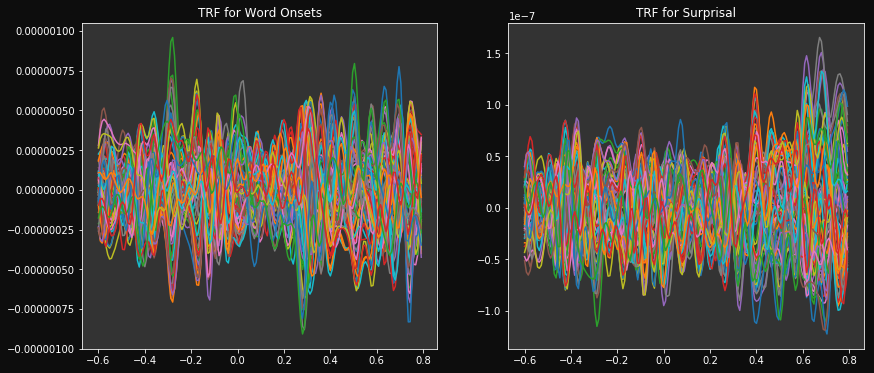

# TRF Tutorial

In this notebook we show how to import word onset as a word-level
feature and compute TRF from them.

## Import EEG

.. code:: ipython3

    import os
    from scipy.io import loadmat
    from pyeeg.io import eeglab2mne
    
    subj_id = 3 # id of participant (3 is subject P04)
    story_id = 1 # id of stories (1 is AUNP02)

.. code:: ipython3

    eeg_path = '/media/hw2512/SeagateExpansionDrive/EEG_data/Katerina_experiment/Processed/Fs-125/interp_bad/BP-0.3-65/Blink_pruned/'
    list_subjects = os.listdir(eeg_path)
    eeg_fname = [f for f in os.listdir(os.path.join(eeg_path, list_subjects[subj_id])) if f.endswith('.set')][0]
    
    event_id = dict(boundary=-1, story_onset=1)
    raw = eeglab2mne(os.path.join(eeg_path, list_subjects[subj_id], eeg_fname), load_ica=False, event_id=event_id)
    raw.pick_types(eeg=True)
    
    # Filtering the EEG
    raw = raw.filter(1, 15, n_jobs=2)

.. parsed-literal::

    1 events will be dropped because they occur on the same time sample as another event. `mne.io.Raw` objects store events on an event channel, which cannot represent two events on the same sample. You can extract the original event structure using `mne.io.eeglab.read_events_eeglab`. Then, you can e.g. subset the extracted events for constructing epochs.

.. parsed-literal::

    /home/hw2512/MachineLearning/Playground/EEG Analysis/pyEEG/pyeeg/io.py:173: RuntimeWarning: 1 events will be dropped because they occur on the same time sample as another event. `mne.io.Raw` objects store events on an event channel, which cannot represent two events on the same sample. You can extract the original event structure using `mne.io.eeglab.read_events_eeglab`. Then, you can e.g. subset the extracted events for constructing epochs.
      raw = mne.io.read_raw_eeglab(input_fname=fname, montage=montage_mne, event_id=event_id, preload=True)

## Import Word-level features

We will load *surprisal* feature and fit a TRF model on both *word
onsets* and *surprisal* word features.

.. code:: ipython3

    # Import all paths
    from pyeeg.io import WordLevelFeatures
    env_path = '/media/hw2512/SeagateExpansionDrive/EEG_data/Katerina_experiment/story_parts/alignement_data/'
    wordfreq_path = '/media/hw2512/SeagateExpansionDrive/EEG_data/Katerina_experiment/story_parts/word_frequencies/'
    surprisal_path = '/media/hw2512/SeagateExpansionDrive/EEG_data/Katerina_experiment/story_parts/surprisal/'
    list_wordfreq_files = [item for item in os.listdir(wordfreq_path) if item.endswith('timed.csv')]
    list_surprisal_files = [item for item in os.listdir(surprisal_path) if item.endswith('3.txt')]
    list_stories = [item.strip('_word_freq_timed.csv') for item in list_wordfreq_files]
    list_env_files = [os.path.join(env_path, s, s + '_125Hz.Env') for s in list_stories]
    
    onset_path = '/home/hw2512/Workspace/EEG_work/all_katerina_onsets.mat'
    onsets = loadmat(onset_path)['onsets']
    
    # Loading word onset and duration for AUNP02:
    wo_path = os.path.join(wordfreq_path, list_wordfreq_files[story_id])
    duration_path = os.path.join(env_path, list_env_files[story_id])
    surp_path = os.path.join(surprisal_path, list_surprisal_files[1])

.. code:: ipython3

    # Create word-level feature object:
    wf = WordLevelFeatures(path_praat_env=duration_path, path_wordonsets=wo_path, path_surprisal=surp_path)
    
    # Creating feature matrix
    x = wf.align_word_features(srate=raw.info['sfreq'], features=('surprisal',))
    
    # Getting EEG data
    y = raw.get_data()
    
    # Croping data with indices that match current story for this participant
    indices = wf.samples_from_onset(onsets[subj_id, story_id], srate=raw.info['sfreq'])
    y = y[:, indices].T

.. parsed-literal::

    INFO:pyeeg.io:Adding feature surprisal

## Run TRF modelling The TRFEstimator class allows to use any arbitrary
set of lags. The lagged time series design matrix will be generated when
fitting the class instance to aligned EEG and feature data.

.. code:: ipython3

    from pyeeg.models import TRFEstimator
    
    # TRF instance
    reg_param = 0. # Ridge parameter
    trf = TRFEstimator(tmin=-0.6, tmax=0.8, srate=raw.info['sfreq'], alpha=reg_param)
    
    # Fit our model
    trf.fit(x, y, feat_names=["Word Onsets", "Surprisal"])

.. parsed-literal::

    INFO:pyeeg.models:Will use lags spanning form tmin to tmax.
    To use individual lags, use the `times` argument...

.. code:: ipython3

    # Plot model:
    trf.plot_single_feature(feat_id=[0,1], figsize=(14,6))

